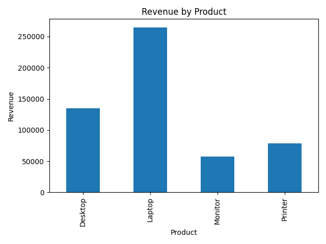
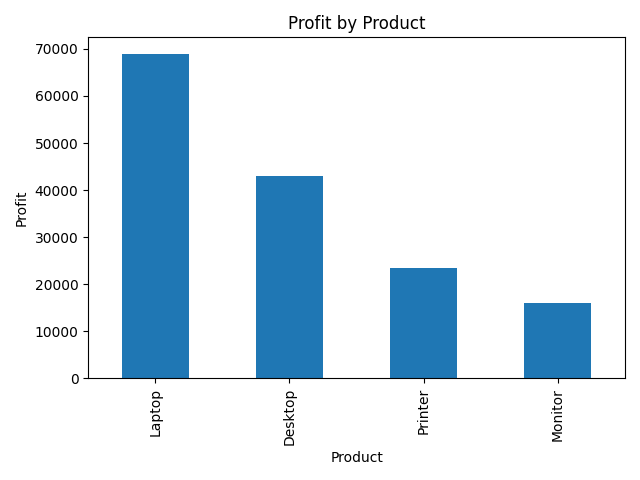

# 📊 Sales Data Analysis using Python

## 📌 Overview
This project analyzes sales data using Python to uncover trends, patterns, and business insights.

---

## 🛠 Tools Used
- Python
- Pandas
- Matplotlib / Seaborn

---

## 📁 Project Structure
- data/ → dataset  
- notebook/ → analysis notebook  
- outputs/ → charts and visualizations  

---

## 🔍 Key Analysis

- Data Cleaning and Preparation  
- Revenue Trend Analysis  
- Region-wise Sales Analysis  
- Product Performance  
- Data Visualization  

---

## 📊 Visualizations

---

## 💡 Key Insights

- Sales show strong growth in Q4  
- Certain regions dominate revenue contribution  
- Product categories vary significantly in performance  

---

## ▶️ How to Run

1. Open `notebook/sales_analysis.ipynb`
2. Run all cells
3. View outputs and charts  

---

## 📌 Author
[Varun.B.Kalale]
